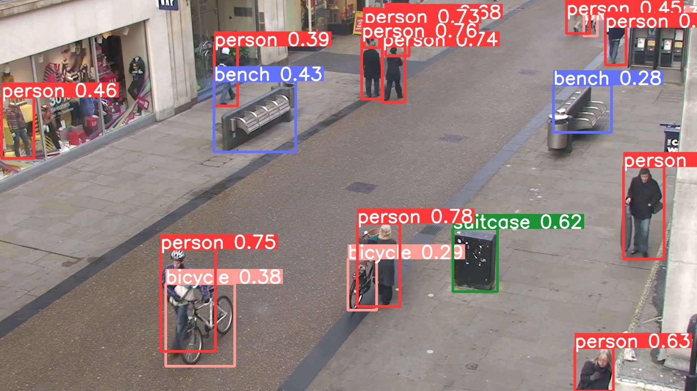

# YERP: Edge CV Stutter Diagnostics

**Find the exact frames that make your Edge CV / ROS pipeline stutter — and know why.**

YERP is a lightweight, local-first stutter diagnostics tool for edge computer vision and robotics deployments. YERP doesn't benchmark models. It investigates runtime incidents.


It does **not** just report FPS. It helps answer the field-debugging questions that actually matter:

- Which frame stuttered?
- Was it inference, postprocess/NMS, input stream jitter, queue backlog, or ROS scheduling?
- Did the frame breach the real-time budget?
- What should the engineer try next?

YERP currently ships with an Ultralytics YOLO adapter, but its core diagnostic path is model-agnostic:

```text
CV model / detector / tracker
        ↓
Adapter
        ↓
FrameInferenceContext
        ↓
StutterEngine
        ↓
StutterEvent
        ↓
Markdown / JSON report
```

---

## Scene Demo: YERP Finds the Stutter Frames



The image above is from a pedestrian scene. This is the kind of input where average FPS can look fine, while individual frames still trigger postprocess pressure, micro-stutters, or control-loop risk.

**Why was this frame marked as Stutter Frames?**

To the naked eye, this looks like a normal detection result.

YERP's runtime trace tells a different story:

- 18 detected objects
- 4 semantic classes
- Confidence entropy: 2.51
- Postprocess: 2.02 ms (28% of total runtime)
- Dominant Cause: `POSTPROCESS_DOMINANT`

YERP did not classify this frame by appearance.

It classified this frame by runtime behavior.

Full runtime evidence:
[frame_000097_1783648890188_RED_POSTPROCESS_DOMINANT.json](assets/frame_000097_1783648890188_RED_POSTPROCESS_DOMINANT.json)

Below is a YERP-style field diagnostic report generated from a 300-frame YOLOv8s dense crowd run.

> Note: `RED` / `YELLOW` are diagnostic severity levels.  
> A `RED` event can indicate structural risk, such as postprocess dominance or tail-latency spike, even if the frame does not breach the current real-time budget.

---

## YERP Field Diagnostic Report

### Executive Summary

| Metric | Value |
|---|---:|
| Frames analyzed | 300 |
| RED frames | 12 |
| YELLOW frames | 244 |
| GREEN frames | 44 |
| Dominant issue | `POSTPROCESS_PRESSURE` |
| Main field suggestion | Tune postprocess/NMS, confidence threshold, `max_det`, and input resolution before blaming the model backbone |

### What this means

For a project manager:

> The model is not simply “slow.”  
> The pipeline becomes unstable under dense-scene pressure.  
> The next debugging step is not random model swapping — it is targeted postprocess and deployment-path diagnosis.

For a field engineer:

> Dense targets are pushing the postprocess path into a risky state.  
> Reproduce with fixed video/model, then sweep `conf`, `max_det`, and `imgsz`.

---

## Top Stutter Events

| Rank | Frame | Severity | Stutter Type | Likely Root Cause | Total Latency | Real-time Budget | Budget Breach | Slowdown | Suggested Action |
|---:|---:|---|---|---|---:|---:|---|---:|---|
| 1 | 269 | RED | `TAIL_LATENCY_SPIKE` | This frame has a latency spike against the local baseline. | 12.55 ms | 40.00 ms | NO | 1.53x | Check system preemption, throttling, and dense-scene pressure. |
| 2 | 264 | RED | `POSTPROCESS_DOMINANT` | Postprocess dominates this frame's runtime. | 9.59 ms | 40.00 ms | NO | 1.19x | Optimize postprocess/NMS before changing the model backbone. |
| 3 | 234 | RED | `TAIL_LATENCY_SPIKE` | This frame has a latency spike against the local baseline. | 11.25 ms | 40.00 ms | NO | 1.54x | Check system preemption, throttling, and dense-scene pressure. |
| 4 | 211 | RED | `POSTPROCESS_DOMINANT` | Postprocess dominates this frame's runtime. | 8.77 ms | 40.00 ms | NO | 1.28x | Optimize postprocess/NMS before changing the model backbone. |
| 5 | 163 | RED | `POSTPROCESS_DOMINANT` | Postprocess dominates this frame's runtime. | 7.34 ms | 40.00 ms | NO | 1.08x | Optimize postprocess/NMS before changing the model backbone. |
| 6 | 172 | RED | `POSTPROCESS_DOMINANT` | Postprocess dominates this frame's runtime. | 7.27 ms | 40.00 ms | NO | 1.07x | Optimize postprocess/NMS before changing the model backbone. |
| 7 | 149 | RED | `POSTPROCESS_DOMINANT` | Postprocess dominates this frame's runtime. | 7.40 ms | 40.00 ms | NO | 1.09x | Optimize postprocess/NMS before changing the model backbone. |
| 8 | 97 | RED | `POSTPROCESS_DOMINANT` | Postprocess dominates this frame's runtime. | 7.16 ms | 40.00 ms | NO | 1.06x | Optimize postprocess/NMS before changing the model backbone. |

### Field Diagnostic Suggestions

1. **Check postprocess/NMS first.**  
   Dense scenes can push output filtering, box handling, tracking, or NMS into a nonlinear cost path.

2. **Do not immediately blame the model backbone.**  
   If postprocess dominates, changing from one model size to another may not fix the root cause.

3. **Run a parameter sweep.**  
   Fix the video and model, then test:

   ```text
   conf = 0.25 / 0.35 / 0.45
   max_det = 100 / 300 / 500
   imgsz = 640 / 960
   ```

4. **Check real-time budget separately from severity.**  
   A frame can be `RED` because it is structurally risky even when it does not exceed the current FPS budget.

5. **Add system probes if tail spikes remain unexplained.**  
   If total latency spikes while stage ratios remain normal, check background processes, thermal throttling, power limits, CPU/GPU/NPU contention, and memory pressure.

---

## Why Average FPS Is Not Enough

Average FPS hides the frames that break real deployments.

In robotics, drones, surveillance, and edge automation, the failure mode is often not:

```text
YOLO is always slow.
```

It is usually:

```text
The pipeline is mostly fast,
but dense scenes, stream jitter, queue backlog, ROS scheduling,
or postprocess pressure occasionally causes a dangerous stutter.
```

YERP focuses on those exact frames.

---

## v0.2 New: Robotics & ROS Evidence

Fast inference does not guarantee a fast robot.

A detector can run at 100 FPS,
yet the robot can still miss a control deadline because the frame
was blocked by:

- ROS Executor scheduling
- TF lookup
- Callback blocking
- DDS / transport delay
- QoS backlog

YERP separates **computer vision latency** from **control-loop latency**.

This distinction is often impossible to see with FPS benchmarks.

It reserves and reports fields for robotics and ROS-side latency diagnosis, including:

| Cause Enum | What it means |
|---|---|
| `ROS_EXECUTOR_DELAY` | The frame waited too long before the callback ran. |
| `ROS_CALLBACK_BLOCKING` | Heavy synchronous work blocked the callback path. |
| `ROS_TF_WAIT` | TF / transform lookup blocked frame processing. |
| `ROS_MESSAGE_ARRIVAL_DELAY` | DDS, camera driver, transport, or network jitter delayed message arrival. |
| `ROS_QOS_DROP_OR_BACKLOG` | QoS depth, stale frames, or queue backlog may be affecting the pipeline. |
| `CASCADE_QUEUE_DELAY` | Previous slow frames accumulated into a queue/backlog problem. |
| `IO_STREAM_BLOCKING` | RTSP, decoder, storage, or stream IO blocked the pipeline. |

This is where YERP starts to separate itself from a simple speed script.

A normal timing script asks:

```text
How fast was the model?
```

YERP asks:

```text
Where did the frame lose time across the CV + robotics pipeline?
```

---

## Installation

For local development:

```bash
git clone https://github.com/YOUR_NAME/yolo-edge-runtime-profiler.git
cd yolo-edge-runtime-profiler
pip install -e .
```

Optional dependencies for examples:

```bash
pip install ultralytics opencv-python rich
```

---

## Quick Start: Generate a Stutter Report

Run a diagnostic audit on a local video:

```bash
python examples/audit_stutter_video.py \
  --model yolov8s.pt \
  --source your_video.mp4 \
  --input-fps 25 \
  --json stutter_report.json \
  --markdown stutter_report.md \
  --max-frames 300
```
Replace `your_video.mp4` with any local video,
or use an RTSP URL for live stream diagnosis.

Run against an RTSP stream:

```bash
python examples/audit_stutter_video.py \
  --model yolov8s.pt \
  --source rtsp://your-camera-stream \
  --source-type stream \
  --input-fps 30 \
  --json stutter_rtsp.json \
  --markdown stutter_rtsp.md
```

For stream/camera sources, `--input-fps` is treated as a nominal reference only.  
YERP still measures observed arrival intervals so RTSP/network/input jitter is not hidden.

---

## Thresholds Are Configurable

Real-time budgets vary by robot, camera FPS, model, hardware, and deployment target.

YERP exposes threshold knobs so developers can tune diagnostics for their own field constraints:

```bash
python examples/audit_stutter_video.py \
  --model yolov8s.pt \
  --source your_video.mp4 \
  --input-fps 25 \
  --min-tail-latency-ms 30 \
  --yellow-slowdown-ratio 2.0 \
  --red-slowdown-ratio 4.0 \
  --min-postprocess-ms 3.0 \
  --min-target-count-postprocess 5 \
  --yellow-postprocess-ratio 0.30 \
  --red-postprocess-ratio 0.50
```

Recommended workflow:

1. Run YERP with defaults.
2. Check the top stutter events.
3. Adjust thresholds based on your FPS budget and safety margin.
4. Re-run the same video/model.
5. Compare `RED` / `YELLOW` counts and root causes.

---

## Python Integration

For existing Ultralytics YOLO loops:

```python
import time
from ultralytics import YOLO
from yolo_edge_runtime_profiler.adapters.yolo_adapter import context_from_yolo_result
from yolo_edge_runtime_profiler.engine.stutter_engine import StutterEngine

model = YOLO("yolov8s.pt")
engine = StutterEngine()

for frame_id, result in enumerate(model("video.mp4", stream=True), start=1):
    ctx = context_from_yolo_result(
        result,
        frame_id=frame_id,
        timestamp_sec=time.time(),
        source_type="file_replay",
        source_name="video.mp4",
    )

    event = engine.process(ctx)

    if event:
        print(event.state, event.cause, event.frame_id)
```

---

## Adapter Architecture

YERP uses a simple data contract so it does not have to stay YOLO-only.

```text
Adapter -> FrameInferenceContext -> StutterEngine -> StutterEvent -> Report
```

The generic input object is `FrameInferenceContext`.

Examples:

| CV pipeline | Generic YERP field |
|---|---|
| YOLO boxes | `target_count` |
| ORB keypoints | `target_count` |
| Industrial regions / defects | `target_count` |
| Classifier entropy | `scene_complexity` |
| RTSP wait | `read_wait_ms` |
| ROS executor delay | `ros_executor_delay_ms` |
| TF wait | `ros_tf_wait_ms` |
| Queue backlog | `estimated_backlog_count` |

Today, YERP includes an Ultralytics YOLO adapter.  
Future adapters can target HALCON, ORB/SLAM, image classification, DeepStream, ROS nodes, or NPU-specific runtimes.

---

## Methodology: Runtime Residual Auditing

YERP uses runtime residual auditing.

Instead of relying only on global averages, it compares each frame against a robust local baseline:

- rolling median
- MAD-based robust deviation
- stage ratio analysis
- scene pressure
- queue / IO hints
- reserved ROS/system fields

A stutter event is treated as a residual:

```text
actual frame behavior - local expected behavior = runtime residual
```

This design is inspired by NARH-style residual auditing: a stutter frame is a runtime residual event where timing, queue behavior, and scene pressure no longer agree with the local baseline.

---

## What YERP Is Not

YERP is not:

- a model trainer
- a cloud data platform
- a replacement for TensorRT / DeepStream / vendor profilers
- a neural-network layer hook
- a promise that every stutter can be identified without platform probes

YERP is:

- a local-first edge CV stutter diagnostics tool
- a frame-level evidence generator
- a bridge between CV engineers, robotics engineers, and field integrators
- a practical way to stop guessing which part of the pipeline caused the stutter

---

## Diagnosis Code Cheat Sheet

| Cause Enum | Human meaning |
|---|---|
| `POSTPROCESS_PRESSURE` | Dense output increases postprocess pressure. |
| `POSTPROCESS_DOMINANT` | Postprocess dominates the current frame runtime. |
| `POSTPROCESS_SPIKE` | Postprocess time spikes against the local baseline. |
| `POSTPROCESS_SPIKE_RISING` | Postprocess time is rising against the local baseline. |
| `TAIL_LATENCY_SPIKE` | Total frame latency spikes against the local baseline. |
| `TAIL_LATENCY_RISING` | Frame latency is rising and may become a spike. |
| `CASCADE_QUEUE_DELAY` | Previous slow frames or backlog suggest queue delay. |
| `IO_STREAM_BLOCKING` | Input stream, decoder, or storage IO may be blocking. |
| `SYSTEM_WIDE_SLOWDOWN` | Whole pipeline slows down, suggesting system contention or throttling. |
| `ROS_EXECUTOR_DELAY` | ROS executor scheduling delay before callback execution. |
| `ROS_CALLBACK_BLOCKING` | Heavy callback work blocks the frame path. |
| `ROS_TF_WAIT` | TF lookup waits block frame processing. |
| `ROS_MESSAGE_ARRIVAL_DELAY` | DDS, transport, driver, or network delay affects message arrival. |
| `ROS_QOS_DROP_OR_BACKLOG` | QoS depth, dropped frames, stale frames, or backlog are suspected. |

---

## License

Apache-2.0
